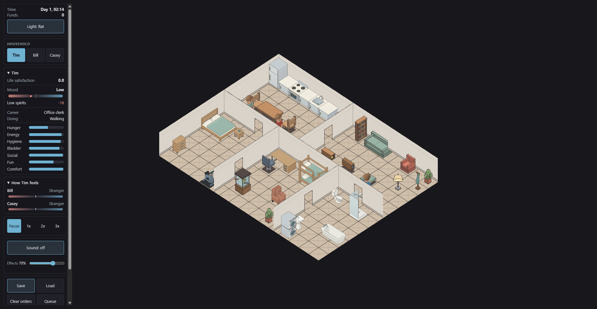
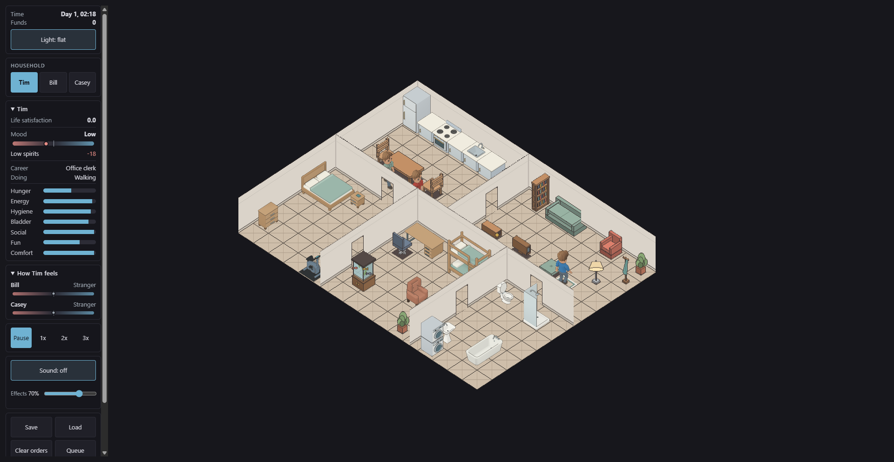
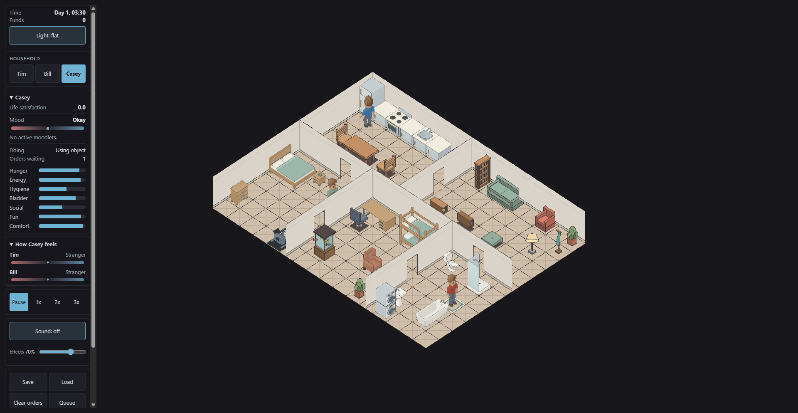

# Bathtub quarter-turn verification

Locally verified on `twcx/interior-layout`, based on main
`d5ec05bca80171374eb1263095866c05dc4af800`. Publication is a separate check.

The accepted candidate-02 SW sprite (1123) becomes the bathtub's default
sprite. Its footprint changes from 2x1 to 1x2 at the existing origin (14,9).
No source art, atlas pixels, interaction duration or need effects change.
The renderer's existing footprint centering now places it at (14,9.5).

## Observed red/green checks

1. Compiled-layout test failed with `Footprint { width: 2, depth: 1 }`
   instead of `Footprint { width: 1, depth: 2 }`, exit 1. Updating content
   passed the focused test, exit 0.
2. Default-art assertion failed with sprite 1121 instead of 1123, exit 1.
   Updating the definition, not just its authored placement, passed, exit 0.
3. The public byte-loader regression failed with the prior structural digest:
   `published Save V1 must survive the quarter-turn`, exit 1. The encoded
   source-shape fixture uses the existing V1 encoder and old collision cells;
   it is not a captured player save.

4. A separate retained fixture now contains an actual save produced by our
   previous local PR83 browser build at Day 1, 02:14. It contains 2,580 bytes,
   SHA-256 `1b4393f7741a66896b7d655d5378dd27a888e32b6d0cbb409cd4e96cd0def2ec`.
   Its public-loader test preserves all fields except the two collision bits
   and destination fingerprint, then compares 300 ticks after resave/reload.
   This fixture is a disposable test household, not a production player slot.

## Checks completed before final migration review

1. `npm --prefix web test -- --maxWorkers=1`: 712 tests, exit 0.
2. `npm --prefix web run typecheck`: exit 0.
3. `cargo test --workspace -j 2 --quiet`: 708 tests, exit 0. Later migration
   corrections require the final run below; this result alone does not cover them.
4. `cargo fmt --all -- --check` and
   `cargo clippy --workspace --all-targets -j 2 -- -D warnings`: exit 0 before
   those later corrections.
5. `python -B -m unittest discover -s assets/models/bathroom -p 'test_*.py'`:
   eight tests, exit 0.
6. `python -B -m unittest discover -s assets/sprites/gen -p 'test_*.py'`:
   67 tests, exit 0.
7. `python assets/sprites/gen/build.py --check`: 1,217 sprites at 4096x7926,
   exit 0. Atlas SHA-256 remains
   `0a4e720f4a023147749cdb559db393133d8904c4f2a86dc00968890ed74db401`.

## Review corrections

Independent review found ordinary saved conversations on the newly occupied
tile, including passive partners that carry only a reservation. Migration now
preserves both participants' contact constraints and activity state. A separate
review found fractional movement segments could cross the tub even when every
remaining waypoint was walkable; the first actual segment is checked too.

A fresh architecture review rejected heuristic wall-ownership inference.
Save V1 has only a combined collision bitmap. The final migration must match
an independently frozen complete shipped layout, not infer architecture from
some remaining wall bits or silently reinterpret old custom worlds.

## Final corrected verification

1. `cargo fmt --all -- --check`: PASS, exit 0.
2. `cargo test --workspace -j 2 --quiet`: PASS, 714 tests, exit 0.
3. `cargo clippy --workspace --all-targets -j 2 -- -D warnings`: PASS, exit 0.
4. `wasm-pack build crates/terri-wasm --target web --out-dir ../../web/src/wasm`:
   PASS, exit 0.
5. `npm --prefix web run build`: PASS, 51 modules, exit 0. Local bundle
   `index-BgbZVmlf.js`, WASM `terri_wasm_bg-D9PfbPAW.wasm`.
6. The final save suite passed 51 tests after deliberate guard-deletion
   checks. Deleting frozen-layout validation made the changed-collision-bit
   test return `Ok(())` instead of `Err(InvalidGrid)`, exit 1. Omitting the
   first-segment reroute trigger left waypoint `(15,10)` instead of safe
   `(13,10)`, exit 1. Restoring each mechanism restored SHA-256
   `7f7ced6258cd2a8d936b81227b52b6a912d727ace38186f63fd8167d7a446f2b`
   for `bathtub.rs`; both focused tests and all 51 save tests passed, exit 0.
7. Earlier source-reference and passive-conversation-contact deletions also
   failed their focused regressions, then passed after byte-identical restoration.
8. `cargo test -p terri-wasm --lib --release -j 2 --quiet`: PASS, 75 tests,
   exit 0. Public-loader guards therefore pass with release assertions and
   optimization, not only in the debug test build.

Independent code review accepted the frozen-layout architecture and movement
repair. Independent visual review inspected all three retained screenshots
and found no blocking orientation, overlap or approach defect. These reviews
did not independently rerun the test suites.

## Played browser upgrade

The dedicated local origin `http://127.0.0.1:4187/` first ran the prior PR83
build and saved at Day 1, 02:14. Reloading after the new build reported
`Saved game loaded`, retained the household/funds and continued from that
clock rather than restarting. The screenshot was paused four ticks later.

The keyboard object menu selected `The Long Soak Directive`, then `Take a
bath` for Casey. Casey reached the rotated tub and the HUD showed `Using
object` at Day 1, 03:30. Saving and reloading during that activity retained
the activity. It completed at 04:35; hygiene rose from 60.3 to 99.9 and Casey
resumed walking. This proves the existing standing interaction, not a new
immersed bathing animation. Only the unrelated favicon request returned 404;
there were no other console errors. The owned tab and preview server closed.

The earlier wait for a literal HUD label `Take a bath` timed out because the
HUD uses `Using object`; the successful check above used the actual label.

## Compatibility boundary

The migration accepts the frozen 16x12 source house with its 34 object
placements and 28 wall cells. It ignores object entity-slot order and runtime
reservations. Nonmatching old custom layouts reject without replacing the
live world; current-fingerprint custom worlds retain the existing loader.
Source bytes are never rewritten by migration. The saved schema stays V1.

Interior wall-edge conversion and the remaining furniture-to-wall gaps are
not part of this release. Their implementation plan is separate.

