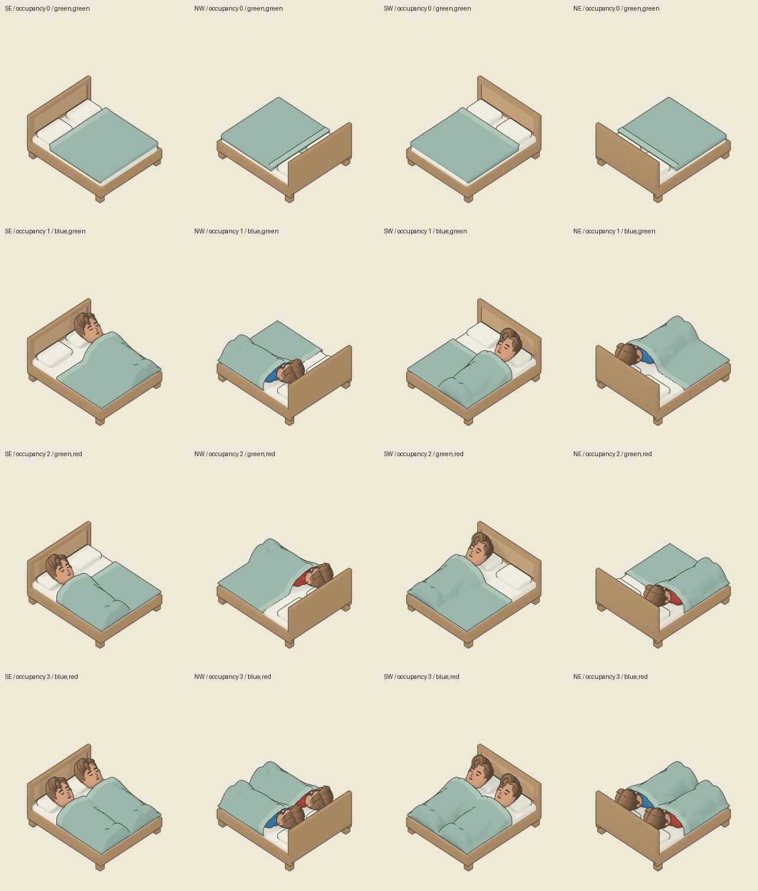

# Covered double-bed export

## Approved appearance and delivery boundary

The owner approved covered candidate 04 and requested publication. The reusable
builder reproduces that pose: sleeping-only scale 0.88, relaxed nearly straight
legs, covered feet and one shaped sage duvet. It hides the original flat duvet
and folded edge in occupied scenes. It does not place another blanket on top.
The original 2 by 2 footprint, bed head end and shared standing/animation rig
remain unchanged. This batch is static; it does not introduce breathing frames
or claim cloth simulation or exhaustive collision certification.

The art task owns the source and export. The bed-assignment task owns renderer,
picking, navigation, saves and publication. The export has passed the checks
below. Actual GPU furniture colourways, fractional zoom, owner picking, played
sleeping and public deployment are still runtime acceptance checks, not claims
made by this document.

## Immutable source and exported bytes

1. Bed source: `assets/models/bedroom/owner-review-pending/double-bed/candidate-02/double-bed-authoring.blend`.
   SHA-256 `3ad570674e768e07bbd6e2d9cac6dfd58a9b59e3202f2be4d5d782dd7f973d9f`.
2. Sim source: `assets/models/sims/sim-01/sim-01-rigged.blend`.
   SHA-256 `919e8994cbf7510a4d9947f173abec8b41ac77d61f6e829bcf5981c8d2fcddce`.
3. Production receipt:
   `assets/models/bedroom/owner-review-pending/double-bed/candidate-03/contributions-01/status.json`.
   SHA-256 `505304d477a5276d61b086ff59b72b6e5631c5327a9ebd039d04908666ecafac`.
4. Runtime manifest: `assets/models/bedroom/export/double-bed-covered/manifest.json`.
   SHA-256 `0c9b1c854d2a74993b1d3e9fb9297e75c4fa5ca59762daa531c363d57acca2cb`.

Blender 4.5.14 LTS, build `62c1db4208e8`, produced 288 RGBA originals at
1280 by 1408. The actual worker exited before receipt consumption. The strict
exporter validated every raw file's complete readability, mode, dimensions,
hash, unique key/path, immutable journal and source-owner witnesses. The receipt
pins the source, scripts, camera registration and colour management. The
numbered metadata journals are tracked; full-resolution PNGs remain locally
available but are ignored, as with bunk contributions.

The 64 exported scenes cover all four facings, masks 0 through 3 and every
active green/blue/red shirt combination. Scene lookup retains both palettes and
occupancy. Identical decoded pixels alone are deduplicated. The common crop is
`[44, 102, 276, 320]`; each layer is 232 by 218 physical pixels at density 2,
with logical dimensions 116 by 109 and anchor
`[58.000009536743164, 93.00043869018555]`. The existing 21-unit registration
offset is applied exactly once before cropping.

## Renderer contract

1. Read `scene-linear-premultiplied-visible-additive` bytes without automatic
   sRGB texture decoding. Fills already include source-resolution attenuation
   by the shared ink alpha. Ink is its own final visible contribution.
2. Apply furniture recolour after sampling and only to furniture: unpremultiply
   furniture, convert linear RGB to sRGB, apply the existing recolour, convert
   back to linear RGB, and premultiply by effective alpha. Do not recolour a
   whole composite or change either Sim's skin or shirt.
3. Sum furniture, active Sim 0, active Sim 1 and shared ink. Do not multiply fills
   by ink alpha a second time. Divide RGB by the actual summed alpha, clamp the
   output alpha separately, then apply the sRGB transfer once. Apply scene
   ambient/tint afterward.
4. Use each body's separate grayscale `coverage` PNG for CPU picking. It is the
   visible raw owner fill alpha, not an encoded reconstruction weight, lane
   rectangle or shared-outline assignment. Blanket/furniture pixels select the
   bed. Shared outline alone is not a separately selectable Sim.
   Grayscale mode `L` stores coverage in the gray value. After an RGBA decode,
   read gray/red, not alpha: the decoded alpha is opaque even where the gray
   coverage is zero. Include a zero-coverage negative picking case.
5. Reuse static frame 0 while sleeping. Keep the existing non-bed pair path
   unchanged. Do not infer that nonlinear recolour before filtering equals
   post-sampling recolour.

## Measured export and visual checks

1. All 64 scenes passed original-coverage comparison and reconstruction checks.
   The largest display-premultiplied channel error is 4 on the 0 to 255 scale;
   every scene's 95th-percentile error is at most 1. The unchanged acceptance
   bounds are maximum 6 and 95th percentile 2. `comparison.json` retains each
   scene's regional results.
2. All facings and masks passed the finite palette audit. Furniture and ink
   pixels remain identical across palettes; each Sim contribution is independent
   of the other shirt palette. Raw visible owner coverage remains identical
   across shirt colours. See `covered-double-bed-palettes.json`.
3. A bounded eight-scene, 72-case fractional-filter control measured a maximum
   display-premultiplied error of 3.021 and 95th percentile at most 0.645.
   Additive linear filtering passes; a causal two-pixel counterexample rejects
   the old multiply-ink-after-filter method. These CPU controls do not replace
   actual GPU review at fractional zoom.
4. The complete representative contact sheet has four facings for empty,
   place-0-only, place-1-only and two-occupant scenes. Primary review and a fresh
   independent visual review also inspected four full-size two-occupant source
   images. Both accepted the static appearance: feet covered, one continuous
   duvet, distinct rear heads, separate shirt collars and no obvious new body
   clipping or deformation. No further pose iteration is requested.
5. Re-exporting the promoted source directory passed full strict validation and
   reproduced the final manifest byte for byte. This verifies relocation of the
   retained batch, not fresh rendering on another Blender build.
6. The 15 causal/unit tests passed. They reject missing/swapped owner witnesses,
   mismatched coverage even with rewritten hashes, duplicate/incomplete
   inventories, unregistered layers, interrupted terminal publication and
   terminal replacement. Document IDs and whitespace checks also passed.
7. A staged-only Git archive passed the retained
   `check-covered-double-bed-export.py` check with 64 scenes, 69 RGB/ink layers
   and 10 grayscale owner coverage masks, without any ignored raw PNG. It
   verifies the exact manifest, journal hashes, pinned producer/export scripts,
   complete scene keys, owner places, layer dimensions, file/decoded-pixel hashes
   and measured comparisons. It also decodes every retained PNG. Run it as
   `python docs/assets/review-evidence/bed-assignment/check-covered-double-bed-export.py PATH_TO_CLEAN_ARCHIVE`.
   This receipt replay does not repeat the raw coverage comparison or replace
   the runtime loader's independent validation.

The display sheet is a review aid. Runtime exports and original renders remain
separate files; the sheet is not used as a model or atlas source.

## Atlas budget

The actual shelf packer, using the dimensions of all 1,700 records on main
`41df46edca2fd61315fb999fb5e1409397d34bcc`, accepts the 69 unique RGB/ink layers.
They add 3,489,744 layer texels. The packed atlas grows from 8192 by 5658 to
8192 by 6096, below the 8192 by 8192 ceiling. Separate CPU coverage masks are
not atlas entries. `covered-double-bed-atlas-budget.json` retains the measured
dimension result. This is a packing proof, not an assertion that an actual
rebuilt runtime atlas preserves every existing pixel; integration must check
that separately against its fresh main revision.
