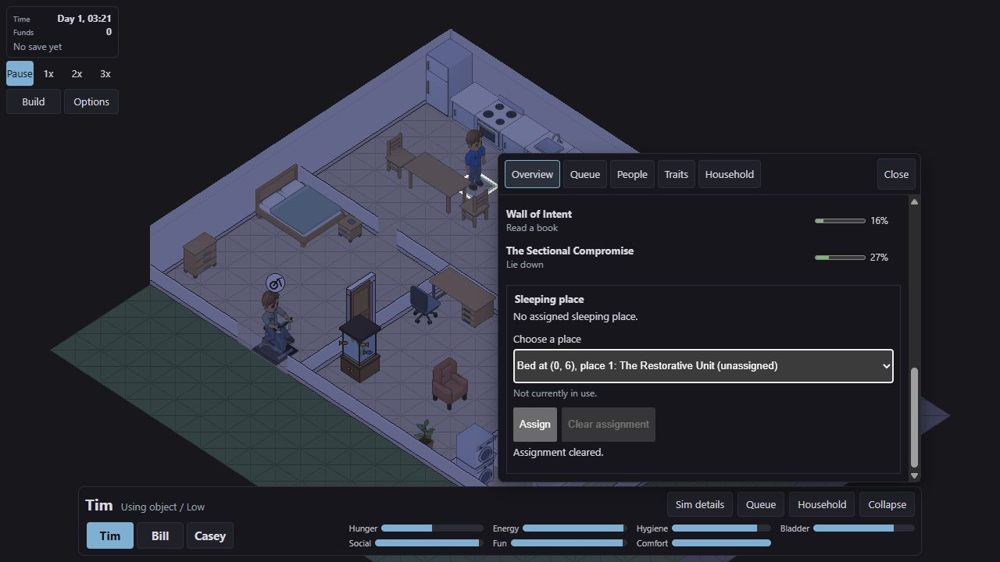
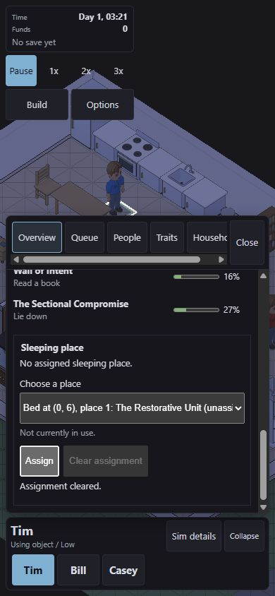
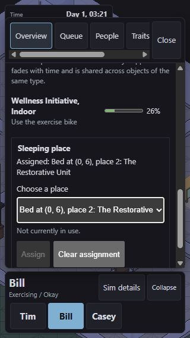
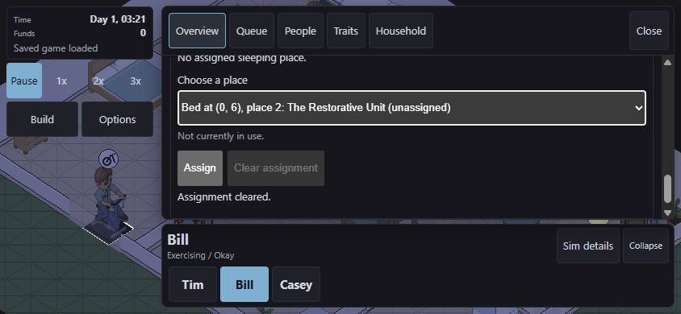

# Bed assignment runtime and controls checkpoint

2026-10-01, local branch `twcx/bed-place-runtime`, based on `c3ba226b`.
Implementation in progress, not published. No release approval is claimed
for two-person sleeping visuals. The later local navigation checkpoint is recorded
in [navigation.md](navigation.md).

## Implemented

1. Separate permanent SimId assignments and active target/place ownership.
   Immediate within-system claims prevent two Sims taking the same place.
   Alternative sleep interactions share physical capacity; non-sleep use
   remains exclusive. Cancellation, completion and death preserve other owners.
2. Ordered set/clear commands with conflict and stale-target refusal. Moving
   an unused bed preserves assignment; active occupants prevent edits and sale.
   Selling clears its assignments. Hashing includes bed, place and assignee.
3. A grouped V5 save tail, explicit migration through all five historical
   load routes, and exact walking/running continuation. Invalid active rows,
   mixed exclusive/sleep owners, incompatible running states, assignments
   and historical assignment commands reject without changing the live world.
4. A copied WASM projection, exact bigint feedback sequence and separate
   assignment controller inside Sim details. The closed dock gains no control.
   Pending commands settle only after drain feedback, and unrelated newer
   feedback requests checking authoritative state rather than claiming success.

The disclosure label now includes bed assignment. Controls identify the bed by
location and name, then its place, assignee and current user. Occupancy includes
walking reservations. Occupancy does not itself prevent permanent assignment.

## Local verification

| Command | Result | Exit |
| --- | --- | --- |
| `cargo test --workspace -- --test-threads=1` | PASS: 1,268 tests, including 740 simulation and 152 WASM tests | 0 |
| `cargo test -p terri-sim beds::tests -- --test-threads=1` | PASS: 22 after the ownership-input refactor and fixture correction | 0 |
| `cargo test -p terri-sim reservations_tests -- --test-threads=1` | PASS: 13 after the refactor | 0 |
| `cargo test -p terri-sim systems::action -- --test-threads=1` | PASS: 45 after the refactor | 0 |
| `cargo clippy --workspace --all-targets -- -D warnings` | PASS | 0 |
| `wasm-pack build crates/terri-wasm --target web --out-dir ../../web/src/wasm` | PASS: release WASM used by bridge and browser checks | 0 |
| `npm run typecheck`, in `web` | PASS | 0 |
| `npm test`, in `web` | PASS: 1,580 tests | 0 |
| `npm run build`, in `web` | PASS | 0 |

The full native run preceded the parameter-only ownership-input grouping;
the affected admission/reservation tests and strict Clippy passed afterwards.
The release WASM browser proof also preceded that grouping. Rebuild the release
artifact after navigation changes before claiming final feature acceptance.
The full web run preceded the disclosure's wording update; no controller or
layout change followed it. These are local checks, not remote CI or deployment.

The initial full web run failed three assertions: two hardcoded old save-tail
offsets and one old toggle-handler string. Their replacements retain the
semantic checks, include the new grouped field, and verify both panel refreshes.

## Browser evidence

The local game at `127.0.0.1:5186` was paused for interaction checks.

1. Keyboard Assign and Clear applied through the normal command drain and
   returned focus to the chooser. The initial implementation lost focus to
   BODY; the corrected surface retains it on an enabled section while pending.
2. Save, Clear, then Load restored the same selected Sim's assignment. The
   chooser reset to its placeholder and stale result text disappeared.
3. Selecting Bill cleared Tim's draft/status and disabled Tim's assigned
   place. Bill could assign the other place and clear it.
4. At 1280 by 720, 390 by 844, 320 by 568 and 844 by 390, no document-level
   horizontal overflow was observed. The select and buttons retained 44px
   height. Select widths at the first three sizes were 487px, 319px and 249px.
   The landscape sheet remained scrollable at 266px height and keyboard Clear
   returned focus correctly. No browser warning/error logs were captured.

Screenshots show the expanded control, not occupied sleeping poses:

The task-owned game tab closed in a finally block, the viewport override reset,
and the preview server stopped. The later disclosure wording change does not
appear in these scrolled screenshots.

## Deliberate faults

Five UI faults each failed a named assertion in `bed-assignment-surface.test.ts`:
remove the choice listener, Assign listener, Clear listener, pending-focus
handoff, or result-focus recovery. Each Vitest run exited 1. Source bytes were
restored to SHA-256
`AB6D95E945545EA4E28C48B96BDE2B3D138EED403DF26D22BDF0787F7583C8C2`.

Four save faults each failed an assertion under `beds::tests` and exited 101:

| Removed mechanism | Failing test |
| --- | --- |
| Exact active-row count | `shared_sleep_state_roundtrips_without_restart_and_rejects_missing_or_conflicting_rows` |
| Mixed exclusive/sleep owner rejection | `mixed_sleep_and_exclusive_claims_reject_modern_and_legacy_loads_atomically` |
| Active-place capacity bound | `shared_sleep_state_roundtrips_without_restart_and_rejects_missing_or_conflicting_rows` |
| Historical command 19 rejection | `historical_loaders_reject_assignment_commands_but_modern_saves_replay_stale_refusals`, at V1 |

Save source bytes restored to SHA-256
`BAF6B55D8CAC59675AF073600E37758A9F0C4B3593391E93F5312959A0559779`.
The final save fault used a custom assertion message, `V1`; the runner's initial
generic assertion-text detector rejected that output. Inspecting the named
panic confirmed the intended assertion, and the corrected targeted run passed
the fault-detection check. All 22 bed tests passed after restoration.

These nine focused faults are not a full mutation sweep. They do not establish
the unfinished path-selection or rendering contracts.

## Independent review and remaining work

Read-only adversarial reviews found and closed the mixed-owner load gap,
incompatible running state, an overstated occupied-fallback fixture, missing
DOM coverage and the keyboard-focus issue. The final UI review found no further
actionable blocker. Reviewers did not rerun the full suites or browser proof.

Authored per-place approaches, blocked and unsafe assigned-side fallback, and
unchanged candidate count now have a separate local navigation checkpoint.
Before publication: complete the occupied double-bed body fit and composite proof; integrate drawing,
picking and indicators only after that contract is established. Repeat affected
release checks and final adversarial review after those changes, then merge
and verify the actual deployment under the existing authorization.
