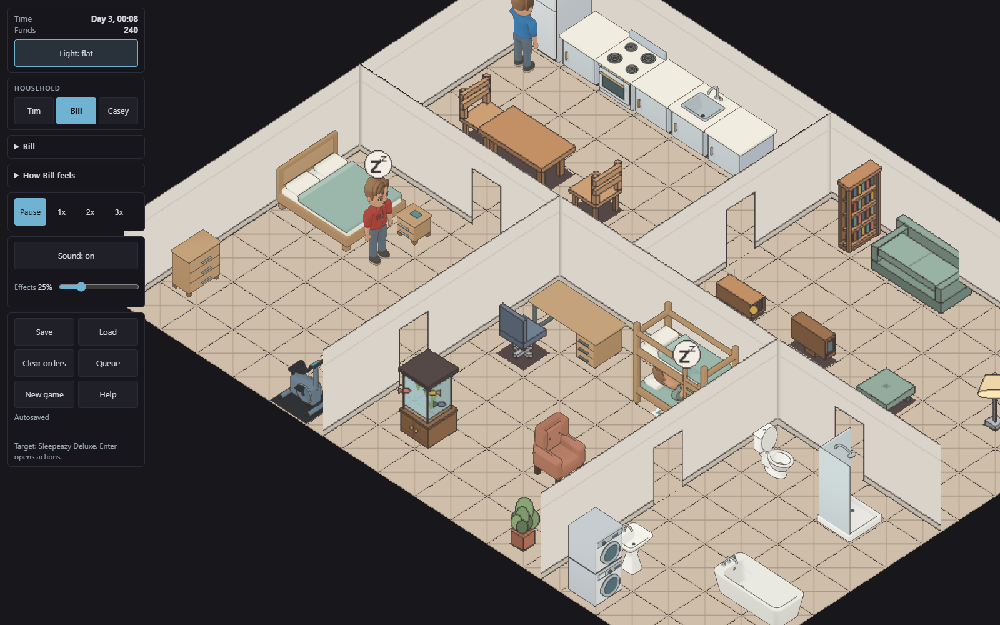
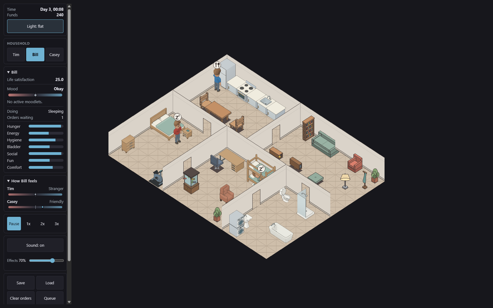
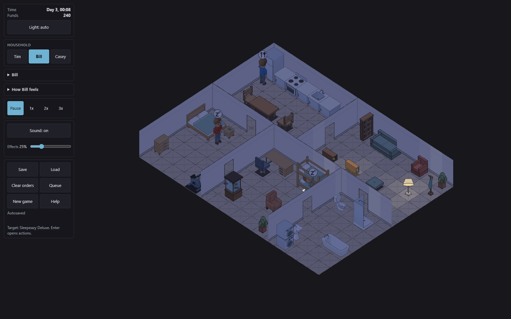

# Near-side bunk ladder and room boundary review

Reviewed September 20, 2026, in `twcx/room-layout-ladder`, based on
`e973cf3d2fe3f14599bcfd5edac0bc86e52bcbae`. This document records local
acceptance, not deployment. Candidate 02's published proof remains in `bunk.md`.

## Scope and unchanged behavior

The owner requested the ladder on the near long side while retaining the
upper-left head end. Candidate 03 moves the ladder and guard opening from
local +X to -X. Head/foot coordinates, footprint, occupied slot, Sim rig,
sleep timing and all four render cameras are unchanged. This is a source-model
change, not a mirrored final sprite.

The owner also chose to move exterior walls and the decorative floor edge
inward to the playable boundary. The kitchen was already on row zero; moving
its objects farther north would be invalid. Exterior walls now sit at -0.5,
and floor coverage is exactly 16x12 tiles. Divider endpoints retain connected
junctions. Camera framing, pan bounds and integer light sampling agree with
the new draw positions. Dining chairs at (1,3)/(4,3) and the desk chair at
(6,7) now face their furniture. Saved positions and collision grids are unchanged.

This batch does not rotate the bathtub or reposition interior-wall furniture.
Interior walls still consume blocked tiles. Rotating the 2x1 bath into 1x2
requires a collision and save-migration design. Moving authored objects also
requires preserving Save V1's saved positions and exact-position facing lookup.
Some legacy furniture variants do not yet provide true opposite-facing art.
These remaining tasks must not be reported as completed by this release.

## Source and export acceptance

Candidate directory: `assets/models/bedroom/owner-review-pending/bunk/candidate-03`.
Four empty and sixteen occupied source views passed primary and independent
review. Structural support checks and four deliberate detachments passed;
contact checking accepted all four poses and rejected three displaced cases.

The completed contribution batch contains 196 full-resolution RGBA originals.
All 48 occupied groups passed comparison with their independent full-scene
renders: maximum error 23, maximum 95th-percentile error 10, below unchanged
limits 64/12. Full original readability, dimensions, hashes and contact evidence
passed `offline_bunk.verify_bunk_generation`.

`bunk-reviewed.json` binds these exact files:

1. Export manifest: `6d8fa54cbc648d9f8d026b80eef33fcafcc916b3c6ff4e58789834e4b598f6e1`.
2. Raw proof: `9b8c3c63a91631a342f170c560389425d7542ae7b8cc361281c678246ae7461c`.
3. Comparison: `c819561e33de181da60ef960380d7ded58475b88a005092509993377beb133e2`.

The rebuilt atlas has 1,217 records at 4096x7926. SHA-256:
`0a4e720f4a023147749cdb559db393133d8904c4f2a86dc00968890ed74db401`.
Only bunk records 1137 through 1212 change. The other 1,141 records, including
all Sims and the desk, preserve their names, indices, dimensions, density and
decoded pixels. Their regression digest was computed from the prior committed
atlas before rebuilding: `12c76daaaec022e850baa092eb8a4bca739e44173ca717f33556c7e784101b42`.
The old export remains retained; the generated revisioned atlas PNG is replaced.

## Played review

The dedicated local game tab served `index-D_1Z72To.js`,
`terri_wasm_bg-DBfCk5aJ.wasm` and the exact new atlas URL. Normal controls selected
Bill, Sleepeazy Deluxe, Sleep. At Day 3, 00:08, the HUD reported Sleeping.
Pause and wheel zoom provided the occupied close view. Independent review
accepted the visible head/arm/torso alignment, near-side ladder occlusion,
guard opening and unchanged head direction. The foreground wall hides the
feet and lower ladder, so source/contact evidence, not this screenshot alone,
establishes those contacts.

Flat and automatic nighttime views show the kitchen against the wall, chairs
facing the table/desk, continuous divider joins and a closed exterior corner.
The only observed console error was the existing missing `favicon.ico` (404).
No save data was cleared. Browser artifacts were copied from the tool's
explicit temporary output directory into this worktree.

## Verification

1. `cargo test --workspace -j 2`: PASS, exit 0.
2. `cargo clippy --workspace --all-targets -j 2 -- -D warnings`: PASS, exit 0.
3. `cargo fmt --all -- --check`: PASS, exit 0.
4. `npm --prefix web test -- --maxWorkers=1`: PASS, 712 tests, exit 0.
5. `npm --prefix web run typecheck`: PASS, exit 0.
6. `python -B -m unittest discover -s assets/sprites/gen -p 'test_*.py'`:
   PASS, 67 tests, exit 0.
7. Bedroom source tests: PASS, 13 tests, exit 0.
8. `python -B assets/sprites/gen/build.py --check`: PASS, 1,217 records, exit 0.
9. `python check-doc-ids.py` and `git diff --check`: PASS, exit 0.
10. Release WASM and Vite production builds: PASS, exit 0.

The chair test failed against the old facings; the ladder-side test failed
against the old source. Renderer mutation checks produced these actual failures:

1. Remove the two exterior junction arms: `expected [838] to deeply equal [844]`.
2. Sample lighting at fractional coordinates: `expected +0 to be 0.12999999523162842`.
3. Move the west run outward again: `expected 84 to be 100` at the corner join.
4. Restore old camera headroom: `expected 370.5 to be close to 360`.

Each mutation run exited 1. Restored `tiles.ts` matched SHA-256
`932b563df2c8f829f868f33466c94beb06ea01e8d5ae4ba2f9bf23bc5afa89ac`;
restored `iso.ts` matched
`53b29f38a5308bc7bcd04fd924f3bfbfb0ab72c88b8c8d25bc586c3ef0864523`.
All 76 focused renderer/camera tests passed after restoration, exit 0.

A staged-only Git archive, without ignored raw render PNGs, also passed atlas
freshness, all 67 sprite tests and all 13 bedroom tests. The signed manifests
and journals therefore validate after checkout, independently of local originals.
All owned browser review tabs were closed after inspection.
