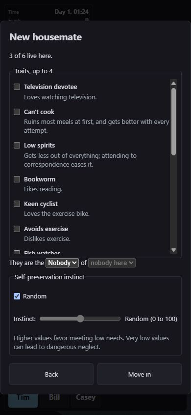
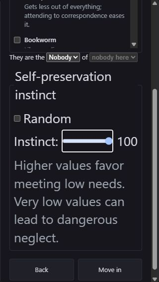

# New housemate control spacing

The phone focus check exposed inline Random and Instinct labels running
together. The instinct fieldset now matches the other form fields, separates
the two labelled rows, and keeps 44px label-row and slider heights. The slider
retains at least 80px of width while long output can wrap.

The first layout attempt failed with enlarged text. A local copy of the
production page changed only `.instinct-controls` from 13px to 26px at a
320 by 568 viewport. Its unwrapped output collapsed the slider to zero width
and overflowed the dialog. Wrapping and a minimum slider width corrected the
cause. This fixture is not shipped and does not simulate every browser or
operating-system text-scaling setting.

## Displayed checks

| View | Observed result |
| --- | --- |
| 320 by 568, ordinary text | Separate labels; manual slider accepted Home and Right, displaying 1; slider 44px high |
| 320 by 568, fieldset text 26px | Random slider 150.05px wide; manual value 100 slider 102px by 44px; no fieldset or dialog horizontal overflow |
| 390 by 844, ordinary text | Random slider 166.70px by 44px; no fieldset or dialog horizontal overflow |
| 844 by 390, ordinary text | Manual slider accepted Home and displayed 0; Tab reached Move in wholly inside the viewport; no horizontal overflow |

The enlarged-text fix was checked with both Random and manual values. All
drafts remained unsubmitted. Browser warnings and errors were empty. The
task-owned page closed in a `finally` block, its viewport override reset, and
the task-owned preview server stopped.

## Checks and review

1. `wasm-pack build crates/terri-wasm --target web --out-dir ../../web/src/wasm`
   passed, exit 0, after integrating main `2021647f`.
2. `npm run typecheck` passed, exit 0.
3. `npm test -- --maxWorkers=1` passed on the final CSS: 1,564 tests in 111
   files, exit 0.
4. `npm run build` passed, exit 0. The enlarged-text fixture was made only in
   ignored build output after the production build.
5. Document IDs and `git diff --check` passed, exit 0.

An independent read-only review found no code blockers. Its enlarged-text
concern led to the measured reproduction above, and it reviewed the wrapping
fix. Its wording correction distinguishes the 44px clickable Random label
from the checkbox's smaller native graphic.

No runtime logic, content, native sources, dependency or artwork changed.
Passing main CI `36829533987` supplies the unchanged native and asset checks.
Local DOM measurements and logs are in `.tmp/bed-assignment/spacing-browser.json`.
