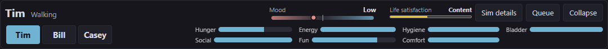
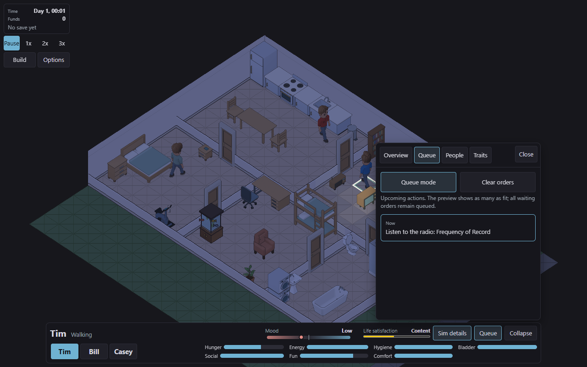
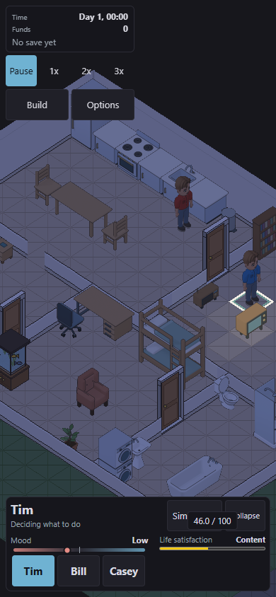

# Dock and life-satisfaction verification

Local implementation on `twcx/dock-panel-controls`, based on `fd75b9c2`, verified on Windows on 2026-10-01. The owner authorized commit, push and merge after local checks and a fresh adversarial review. The implementation was then integrated with main at `ba7d1a97`. Remote checks and automatic publication are reported separately at delivery.

## Result

1. A second activation closes the dock's panel. Sim details closes its sheet from any section; Queue toggles its section. Navigation tabs keep selecting their section.
2. Mood uses 12px bold text beside an 11px label. Its desktop track measures 181.91px at 1280 by 800.
3. Life satisfaction uses a centered native 0-100 meter with five status bands. Hover, keyboard focus and emulated touch reveal the score to one decimal place. Accessible labels include the band and score. New Sims start at 50 with combined trait offsets limited to nine points; loading never reapplies those offsets. Saved scores within the range restore exactly; historical totals above 100 saturate at 100.
4. Queue mode is named explicitly and starts enabled on page load. Closing its panel preserves the player's choice.
5. Sim details stays highlighted while its sheet is open; Queue stays highlighted while its section is open. Toggle, Close, Escape, Collapse, Options and Build update the expanded state. Leaving Build restores the previous sheet state.

[Life satisfaction](../../../specs/2026-10-01-life-satisfaction.md) defines the bounds, pacing, thresholds and future expression direction. New facial expressions and animations are recorded for later work and are not implemented here.

## Initial implementation checks

Commands ran from the repository root unless marked `web/`.

| Command | Outcome | Exit |
| --- | --- | --- |
| `npm ci --no-audit --no-fund` (`web/`) | PASS: existing locked packages installed; manifests and lockfile unchanged | 0 |
| `cargo fmt --all -- --check` | PASS | 0 |
| `cargo clippy --workspace --all-targets -j 2 -- -D warnings` | PASS | 0 |
| `cargo test --workspace --lib --tests -j 2 -- --test-threads=2` | PASS: 1,292 unit and integration tests across all crates | 0 |
| `cargo test --workspace --doc -j 2` | PASS: command completed; no runnable documentation tests | 0 |
| `cargo test --workspace --no-run -j 2` | PASS: all workspace test targets and examples link after the study exits | 0 |
| `wasm-pack build crates/terri-wasm --target web --out-dir ../../web/src/wasm` with `CARGO_BUILD_JOBS=2` | PASS: release browser simulation rebuilt | 0 |
| `npm test -- --maxWorkers=1` (`web/`) | PASS: 1,787 tests in 119 files against rebuilt WebAssembly | 0 |
| `npm run typecheck` (`web/`) | PASS | 0 |
| `npm run build` (`web/`) | PASS: production bundle | 0 |
| `node --test scripts/build-changelog.test.mjs` | PASS: seven tests | 0 |
| `node scripts/build-changelog.mjs` | PASS: source notes render | 0 |
| `python check-doc-ids.py` | PASS: unique documentation identifiers | 0 |
| `git diff --check` | PASS | 0 |

The first web run timed out on four existing atlas tests while Rust compiled. The isolated atlas rerun passed, followed by the complete suite without those timeouts. The initial Rust runs exposed old fixture expectations for zero starting scores, unbounded gains, raw reward units and trait descriptions; the final fixtures use the new contract. Trait descriptions retain their one-sentence, 80-character limit. No dependencies changed.

[Deliberate-defect receipts](mutations.md) name each changed mechanism, show actual assertion failures and link source restoration digests. They cover neutral creation, both bounds, reward conversion, trait offsets, exact save restoration, long-term pacing, small neglect, display bands, panel closure, Queue mode's default and persistent highlights. They are targeted evidence, not a full repository mutation sweep.

## Browser evidence

The production preview used task-owned port 4186 and `?stress=0`.

`web/proofs/dock-wellbeing.js` passed ten ordinary viewport sizes and five doubled-text sizes, including 320px phones, 601px narrow desktop and short landscape. No header element or page overflow was detected. It checked household selection, collapse, tabs, dialog focus and 20 unchanged paused refreshes with zero text replacements. Display fixtures exercise the longest satisfaction label without changing the world. [layout.json](layout.json) records bounds.

`web/proofs/dock-controls.js` checked both openers, mode state, highlight colors away from pointer hover, close routes, focus return, mood typography, meter width and centered satisfaction. It exercised every satisfaction band and both hover and focus disclosure. [controls.json](controls.json) records results. A separate 390px mobile browser context with touch enabled verified that tapping the summary focuses it and reveals `46.0 / 100`; [touch.json](touch.json) records the accessible value.

The proof pages close in `finally`. Task-owned game pages and the preview server were closed after verification; port 4186 had no listener. There were no page exceptions in the responsive proof. A browser console entry was a missing favicon request. Physical-device checks and actual screen-reader announcements remain unverified; the native meter and accessible descriptions were inspected through the browser.

## Long-term household observation

The deterministic [study](../../../../crates/terri-sim/examples/satisfaction_study.rs) ran the shipped household through day 365 with death, autonomy, careers, conditions and ordinary need decay enabled. The run used the debug example built by Cargo, invoked as `target/debug/examples/satisfaction_study.exe`; it exited 0. [satisfaction-study.csv](satisfaction-study.csv) contains the observations.

| Day | Bill | Casey | Tim |
| --- | --- | --- | --- |
| 0 | 50.000 | 52.000 | 46.000 |
| 7 | 49.746 | 50.612 | 43.095 |
| 30 | 48.743 | 45.767 | 32.489 |
| 90 | 45.989 | 32.503 | 5.541 |
| 180 | 39.554 | 14.483 | 0.000 |
| 365 | 29.130 | 0.000 | 0.000 |

All three Sims remained present. In this unattended scenario, persistent negative mood outweighed direct activity and career rewards. Tim reached zero between days 90 and 180; Casey between days 180 and 365. This measures the shipped household under unattended play, not a healthy-mood baseline. The fixed-mood tests separately prove gains, losses, neutral stability and both endpoints.

The study's debug executable held a Windows file lock while it ran. One full Cargo command could not relink that same executable. Unit and integration tests therefore ran separately, followed by documentation tests and a successful full link check after the study exited. Passing runtime tests were not repeated to clear the linker diagnostic.

## Combined-main verification

The integration preserves main's sleeping places, social boundaries, Build controls, wrapped sheet tabs and reorganized Help. Same-day notes extend `docs/changelog/2026-10-01-meals-and-cleanup.md` under the current authoring guide. The prior draft entry is removed. One newly integrated interpersonal test assumed a zero default; it now seeds its intended score of 10 explicitly.

1. `cargo fmt --all -- --check`: PASS, exit 0.
2. `cargo test --workspace -j 2 -- --test-threads=2`: PASS, exit 0, 1,418 unit and integration tests. Documentation test commands complete with no runnable examples.
3. `cargo clippy --workspace --all-targets -j 2 -- -D warnings`: PASS, exit 0.
4. `wasm-pack build crates/terri-wasm --target web --out-dir ../../web/src/wasm`, with `CARGO_BUILD_JOBS=2`: PASS, exit 0, rebuilt release simulation.
5. `npm run typecheck` and `npm run build` in `web/`: PASS, exit 0.
6. `node --test scripts/build-changelog.test.mjs`: PASS, exit 0, 12 tests. `node scripts/build-changelog.mjs`: PASS, exit 0.
7. `python -B -m unittest discover -s .github/scripts -p 'test_*.py'`: PASS, exit 0, 23 workflow guards. `python check-doc-ids.py`: PASS, exit 0.
8. `npm test -- --maxWorkers=1 --exclude tests/atlas.test.ts` in `web/`: PASS, exit 0, 1,782 tests in 125 files.
9. `cargo tree -p <crate> --target <target>`: PASS, exit 0 for each of terri-core, terri-data and terri-sim on x86_64-unknown-linux-gnu and wasm32-unknown-unknown; no web dependency appears.

The initial combined `npm test -- --maxWorkers=1` command exited 1: 1,794 tests passed, and two existing atlas tests exceeded their five-second timeout while reading model assets. Those tests read unchanged asset sources and do not exercise the dock or satisfaction changes. The owner authorized skipping completely unrelated checks. The atlas file and unchanged sprite/model generator suites are excluded from this delivery's required checks; the timeouts are not reported as passing assertions.

Fresh adversarial review found no implementation correctness defect. Its three evidence findings are resolved: independent lower-score and creation-bound failures, authored finite/range guard failures, and actual dock-control failures with restoration digests. The review verified all eight new restoration hashes against the combined source. The failed web result-capture file is replaced with parsed measurements from the combined production build.

Both browser proofs passed again after integration, including ten ordinary viewports, five doubled-text viewports, panel closure and focus, persistent highlights, Queue mode state, every score band and 20 unchanged paused refreshes. `layout.json` parses and contains the expected non-empty collections. Screenshots from those proofs now show the combined build. The task-owned browser pages and preview server were closed; port 4186 has no listener. The earlier touch observation and year-long study retain their original pre-integration scope.

Targeted deliberate defects are verified here; a full repository mutation sweep is additional remote evidence and is not claimed as a local pass. Remote CI and GitHub review are not delivery gates under the owner's instruction. Physical-device and actual screen-reader checks retain the limitations above.
