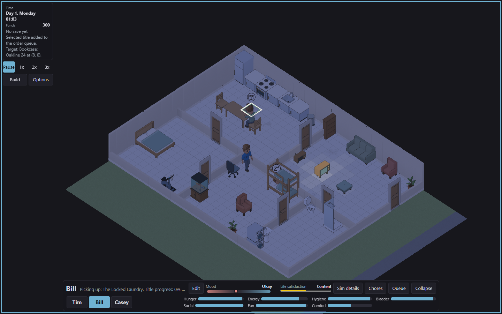
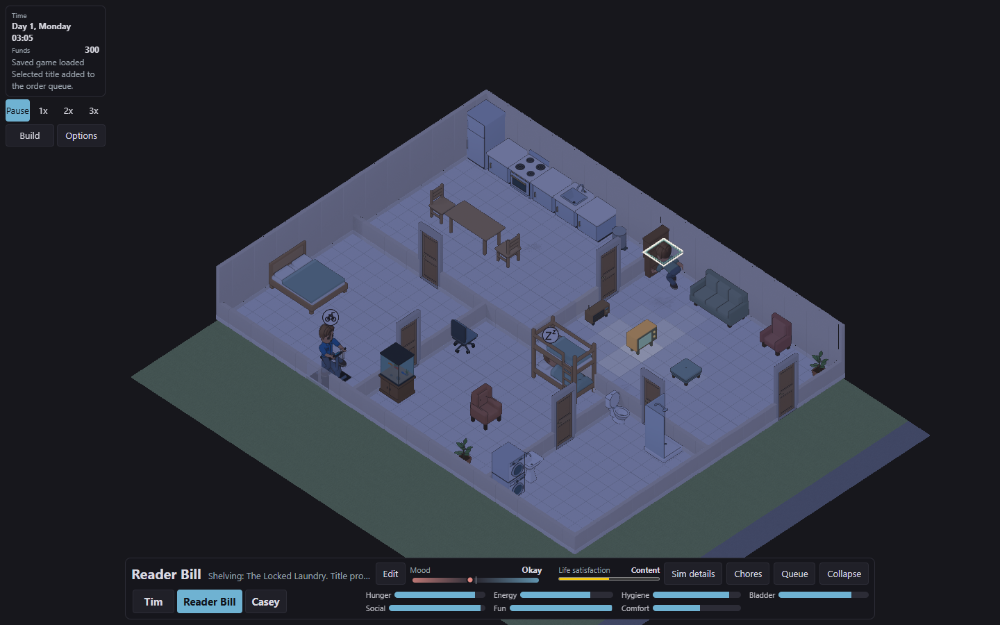
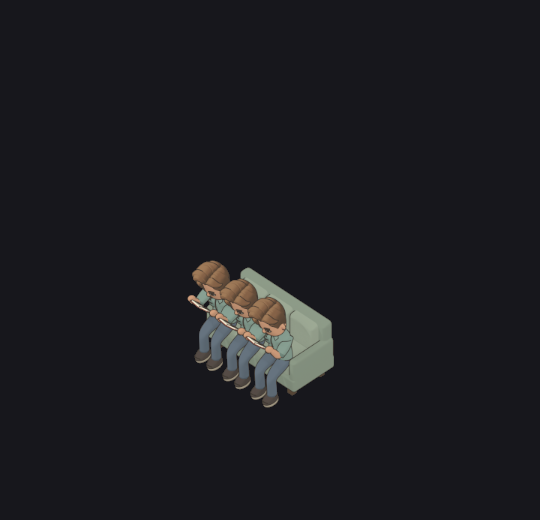

# Object models, books and seating: release review

Implementation and local verification are complete. Owner approval of the product copy and artwork is pending; this record does not claim a merge or deployment.

## Product copy and balance

[Review every model and book](catalogue/catalogue-balance-and-copy-review.md). The table contains the complete model names, descriptions, prices, capacities, action details and trade-offs, plus the book catalogue. Its content matches the earlier review proposal exactly; its compiled-source fingerprint has been refreshed.

## Running game

The browser check bought a real copy, commanded reading through the object menu, captured pickup and shelving, saved and loaded an active session, and verified that the same copy returned to its shelf. Keyboard and touch checks kept descriptions closed until activation. An older household retained its original backup and received starter books only once.

The sofa image is a production-renderer fixture. The preceding images are the running game. [Browser receipt](final-runtime/browser/receipt.json).

## Shelf artwork change

[Compare previous and revised shelf lighting](shelf-lighting/README.md). Cabinet and within-row shadows remain. Books no longer cast shadows onto the cabinet or another row, allowing independently owned shelf rows to compose correctly. Geometry, materials and light directions remain the same. This is a source-art change for review.

## Verification

Rust workspace tests, lint and formatting passed. The complete web suite passed 2,194 tests before the final storage-version correction; all 79 targeted storage/controller tests then passed, including actual simulation save bytes and previous-worker overwrite protection. Type checking and the production build passed after that correction. The asset generator's reproducibility check passed.

Production-renderer comparisons passed for all 2,412 fetch/return cases, 720 shelf-inventory cases and 1,488 sofa cases. The sofa set includes 972 actual uniform-colour source comparisons and 516 mixed-colour references assembled from separately indexed owner contributions. Object and occupant picking passed. Source and rendered-image receipts are retained under [final-runtime](final-runtime/).

The browser reported the existing missing favicon; it reported no unexpected console errors or failed game-resource requests. Public notes are in [the October 7 changelog](../../../../changelog/2026-10-07-books-and-seating.md).
