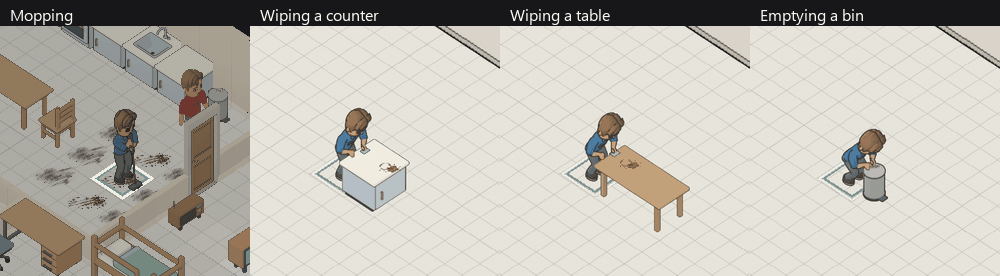

# Cleaning animation verification

**Visual approval superseded.** The owner rejected these captures because heavy
outlines obscured the eyes and the mop resembled a scraper. The review below
missed those defects. Its gameplay and test results remain historical evidence;
its visual conclusion is not acceptance of the corrected artwork. See the
subsequent [appearance correction](../2026-10-05-cleaning-appearance/README.md).

Verified locally on 2026-10-05 in `twcx/household-chores`, based on
`1a138df6`. Changes remain uncommitted. A final fetch and fast-forward pull
reported that origin/main was current.

## Played evidence

The combined GIF shows independent game captures at ten simulation ticks per
second. Completed jobs hold their last captured image. Each clip comes from
the real chore scheduler and browser renderer; no body poses were injected.

`mopping.gif` shows a normal household cleaning nine tiles together. Grime falls
from 1000 to zero over 24 ticks while the mop moves. Another housemate deposits
100 grime on tile 84 outside that patch; this remains after the patch finishes.
`dishwashing.gif` verifies the existing sink animation. The receipt also records
the preceding held-dish walking stage.

The counter, table and bin GIFs show each of four approach sides in isolated
scenes. The fixture uses production household construction, ordinary needs and
real cleanup commands. `browser-proof.json` records all twelve runs, matching
world hashes and animation progress after saving and loading during work, and
zero remaining progress and grime on completion. No browser warnings, errors
or failed HTTP requests were recorded. Temporary browser contexts close in
`finally`; the user's separate preview remains paused with audio disabled.

An independent reviewer inspected ordered contact sheets and consecutive
full-resolution samples. The reviewer verified cloth/hand contact, furniture
occlusion, mop ground contact and the opening, lift, removal and closing bin
sequence. No additional visual defects were found. This was an ordered-frame
review, not a human approval of normal playback cadence.

## Checks

| Command | Result | Evidence |
| --- | --- | --- |
| `cargo test --workspace` | PASS, exit 0; 128 core, 281 data, one compile fixture, 987 simulation and 177 boundary tests | `native-tests.log` |
| `cargo clippy --workspace --all-targets -- -D warnings` | PASS, exit 0 | `clippy.log` |
| `cargo fmt --all --check` | PASS, exit 0 | `format.log` |
| `wasm-pack build crates/terri-wasm --target web --out-dir ../../web/src/wasm` | PASS, exit 0 | `wasm-final.log` |
| `npm test -- --maxWorkers=1` in web | PASS, exit 0; 2022 tests | `web-final.log` |
| `npm run typecheck` in web | PASS, exit 0 | `typecheck-final.log` |
| `npm run build` in web | PASS, exit 0; existing bundle-size warning remains | `production-build.log` |
| `python assets/sprites/gen/build.py --check` | PASS, exit 0; generated pixels and metadata match | `atlas-check.log` |
| `python -m unittest discover -s assets/sprites/gen -p test_cleaning.py` | PASS, exit 0; source hashes, palette geometry, distinct samples and contacts | `cleaning-art-tests.log` |
| `node --test scripts/build-changelog.test.mjs` | PASS, exit 0; 12 tests | `changelog-tests.log` |
| `node scripts/build-changelog.mjs` | PASS, exit 0 | `changelog-build.log` |

The full sprite-generator suite ran 196 tests. It identified obsolete inventory
expectations in the aquarium-prefix and content-bounds tests after the appended
sitting and cleaning records. Those expectations now distinguish additions
from the published prefix without changing its pinned hashes. Rerunning
`test_aquarium_prefix.py` and `test_content_bounds.py` passed all 13 tests;
all other tests passed in the full run. See `art-tests.log`, `prefix-tests.log`
and `bounds-tests.log`.

Three deliberate defects were tested: use global time instead of work progress,
pick a closed bin instead of its visible lid, and omit the foreground contact
mapping. Each regression test failed. Every modified file was restored to its
original SHA-256 before the final passing web suite. `fault-results.json`
records the test commands, failure exit codes and restored hashes.

## Reproduction and scope

Generate the isolated saves with
`cargo run -p terri-wasm --example cleaning_animation_review -- web/public/.tmp`.
The fixtures committed under `web/tests/fixtures/cleaning-animation` exercise
the compiled WebAssembly interface, aligned progress columns, frame selection,
foreground instance counts, cancellation and save/load.

The editable cleaning model, raw-render receipt and exported frame manifests
are under `assets/models/cleaning`. The approved source rig is unchanged.
The export contains 336 body samples, 32 bin frames and 80 hand/tool masks.
All four directions and all three shirt palettes are checked. No dependencies,
work durations, save layouts or chore mechanics changed for these animations.

Cleaning tools appear during stationary work. Travel uses the ordinary walking
clip. Reduced motion holds a useful middle sample. No new cleaning audio was
added. Owner visual acceptance and publication are separate from these local
checks.
