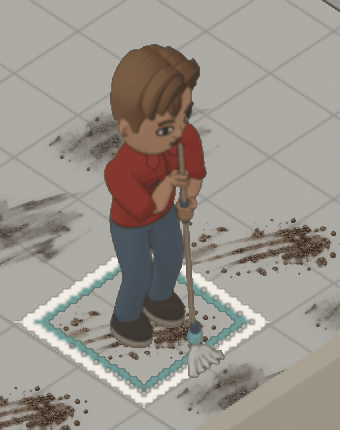

# Cleaning appearance correction

The owner rejected the first cleaning export for blackened eyes and an
unrecognizable mop. A second candidate corrected the eyes but retained relaxed
hands and used a radial loop head that the owner also rejected. Earlier visual
review conclusions are superseded; passing simulation tests did not establish
acceptable artwork.

## Diagnosed defects

The accepted rig uses four-pixel outlines at sixteen pixels per logical pixel.
The cleaning bake used four pixels per logical pixel without scaling the
outlines. That made ink four times too thick. A render with outlines disabled
exposed intact eye whites beneath the ink. Regrouping the character also emptied
the hair's authored outline-selection collection.

The corrected bake uses one-pixel outlines at density four and preserves the
hair selection. Pixel comparisons across sixteen green front-facing samples
found zero light pixels in the rejected eye regions and visible whites in every
corrected sample. The exporter checks the outline ratio and tests all front
mopping samples across household colours.

The former grip assertion aligned a point in each relaxed palm with the handle.
The approved rig has no finger bones; rotating that hand cannot close its
fingers. The replacement uses action-specific curled fingers, opposing thumbs,
palm heels and wrist transitions, bound to the existing hand bones. The original
relaxed hands remain for other actions. Skin materials and the approved shared
rig file are unchanged.

The replacement head uses eighteen open-ended cotton strands gathered under a
narrow binding, hanging down and spreading unevenly along the floor. It has no
radial loops returning to the binding. The discarded full batch was stopped
before export after the owner rejected its hand and head geometry.

## Pilot review

A fresh independent reviewer inspected frames 0, 2, 4 and 6 from all four
directions before the replacement full bake. The reviewer found readable eyes,
closed grips, attached wrists and a recognizable cotton mop without the flower
silhouette. The reviewer also noted simplified, ring-like finger contours and
a relatively flat yarn bundle. This supports proceeding to played verification;
it is neither a claim of anatomical realism nor owner visual approval.

Geometric checks cast radial rays through the grip's middle-finger cross-section
at five-degree intervals. Both grips enclose the handle through 360 degrees.
The left hand fits the 14 mm shaft radius; the right fits the 23 mm rubber sleeve.
The measured minimum skin clearance is approximately 0.94 mm, with opposing
contact gaps below 1.82 mm. These checks establish enclosure and fit, not
appearance quality. Saved poses separately verify wrist placement.

## Final played result

The final capture loads an explicitly staged review save with Casey on the open
kitchen tile at (6,3). The native fixture queues the normal floor-cleaning command
and advances until work begins. Household traits, needs, autonomy, grime and
work durations retain their normal behavior. The browser then advances 24 real
simulation ticks. The nine seeded tiles clear, pausing holds the world hash, and
no browser warnings, errors or failed requests are recorded in `played-mop.json`.
The GIF uses the normal 100 ms tick cadence and holds the last image before
looping. The 1x, 2x and 4x captures retain the game scene for scale and contrast.

A fresh reviewer directly compared `owner-rejected.png` with the three zoom
levels and ordered samples at ticks 0, 3, 6, 12, 18 and 22. The reviewer found
distinct whites and pupils, both hands enclosing and following the shaft,
continuous wrists, recognizable gathered cotton and floor contact throughout
those samples. No further instance of the reported defects was identified.
The finger contours remain deliberately simplified. This review inspected
ordered stills, not GIF timing, and is not owner visual approval. Because the
final view is mostly unobstructed, it does not independently establish moving
foreground occlusion.

The corrected counter, table and bin exports were also replayed through all
twelve approach cases in the browser. Each saved and reloaded with the same
hash and progress, then completed. The receipt in `surface-proof.json` records
zero warnings, errors or failed requests. Representative updated views are
`table-wiping.png` and `bin-emptying.png`.

The saved model also passed 32 evaluated-mesh grip checks covering both hands,
four views and four stroke phases. `grip-validation.json` records the model hash
and measured radii. This goes beyond checking construction coordinates: the
validator reopens the saved model and evaluates its skinned hand geometry.

## Verification

| Command | Result | Evidence |
| --- | --- | --- |
| `python -m unittest discover -s assets/sprites/gen` | PASS, exit 0; 198 tests | `art-tests.log` |
| `python assets/sprites/gen/build.py --check` | PASS, exit 0 | `atlas-check.log` |
| `wasm-pack build crates/terri-wasm --target web --out-dir ../../web/src/wasm` | PASS, exit 0 | `wasm-build.log` |
| `npm test -- --maxWorkers=1` in web | PASS, exit 0; 2022 tests | `web-tests.log` |
| `npm run typecheck` in web | PASS, exit 0 | `typecheck.log` |
| `npm run build` in web | PASS, exit 0 | `build.log` |
| `cargo run -p terri-wasm --example chores_review -- web/public/.tmp/grime-casey.sav 1000 2` | PASS, exit 0; real chore starts before save | `casey-fixture.log` |
| `cargo fmt --all --check` | PASS, exit 0 | `format.log` |
| `cargo clippy -p terri-wasm --example chores_review -- -D warnings` | PASS, exit 0 | `fixture-clippy.log` |
| `node --test scripts/build-changelog.test.mjs` | PASS, exit 0; 12 tests | `changelog-tests.log` |

The optional third fixture argument chooses the persistent Sim identity and
starts its real chore at an open review location. Omitting it preserves the
existing fixture behavior. The initial capture used a fixture that positioned
Tim while selecting Casey; a door obscured the hands. An unrelated sink route
did not cross the guessed staging tile. Fresh review identified the missing
fixture precondition. The corrected fixture owns both identity and staging.

No gameplay algorithms or save layouts changed in this correction. Earlier
native gameplay and persistence tests remain recorded in the preceding cleaning
evidence. Original rig bytes and published sprite pixels remain protected by
the asset checks. Temporary test browser contexts close in `finally`.

The user's game was saved before the texture update. Development reloads
restarted it at 1x and subsequent autosaves advanced the saved time. It was
paused again after the final reload; no test fixture replaced that household.
Future development captures must retain a separate byte copy before a reload,
since the single save slot can be overwritten by autosave.
