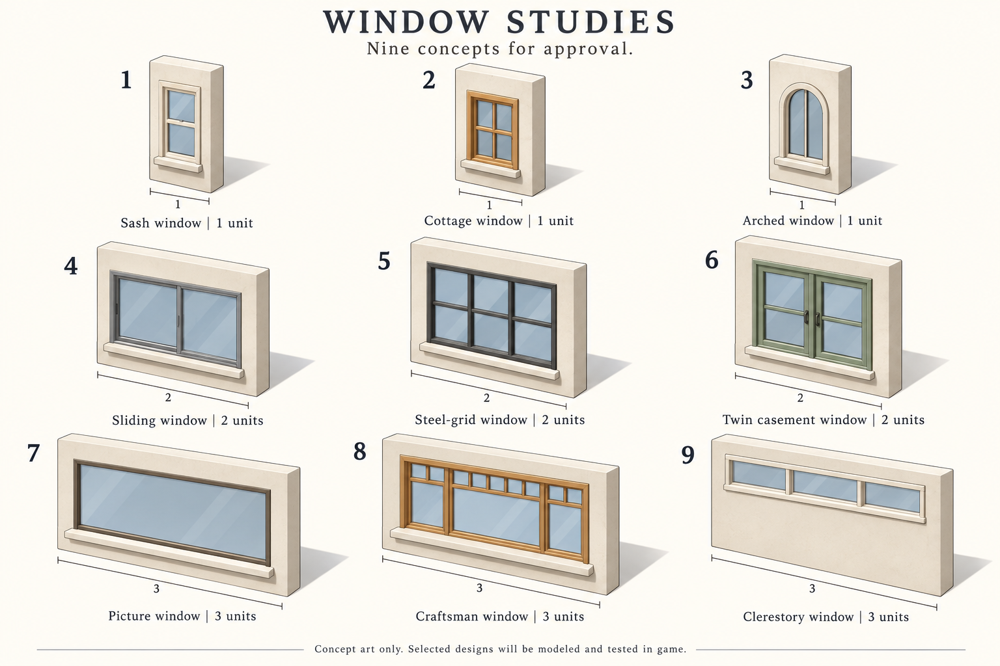

# Windows, walls and floors

Status: implementation approved by the owner on 2026-10-01, using task-by-task
implementation with independent reviews. All nine window designs below are
approved. The owner accepted candidate08's wall and floor appearance on
2026-10-01. The owner also requested better walls and
floors after seeing the window concepts. This document records the intended
result and proposed engineering decisions; it does not report implemented art.

## Approved direction

The owner approved the nine window appearances and their displayed widths.
The wall appearance in that image is a requested direction: substantial warm
plaster, visible thickness, restrained bevels, recessed glazing and readable
sills. It is not an image of the existing game. The image contains no floor
design. The owner accepted the floor treatments in the actual candidate08 room
preview, including oak boards, pale ceramic tile and muted blue carpet.

| Number | Model | Width in wall units | Distinguishing geometry |
| --- | --- | --- | --- |
| 1 | Sash window | 1 | Cream frame, two vertically stacked sashes |
| 2 | Cottage window | 1 | Oak frame, four panes and a substantial sill |
| 3 | Arched window | 1 | Rounded cream surround and one central vertical bar |
| 4 | Sliding window | 2 | Gray frame, two broad panes and an overlapping center rail |
| 5 | Steel-grid window | 2 | Charcoal frame, three columns by two rows of panes |
| 6 | Twin casement window | 2 | Sage frame, two closed leaves and small center handles |
| 7 | Picture window | 3 | Bronze frame and one broad uninterrupted pane |
| 8 | Craftsman window | 3 | Oak frame, broad center, side panes and upper small lights |
| 9 | Clerestory window | 3 | Shallow, high-mounted ribbon with three panes |

A unit is one boundary between neighboring floor tiles. These are nine models
with fixed widths, not 27 models created by stretching each design to every
width. A two- or three-unit model is one placed window. Sliding and casement
describe its construction; opening animations are outside this change.

## What should change visually

1. Replace the blue wall placeholder with recognizable framed glazing set into
   an opening. Model the surrounding wall, reveal, lintel and sill together so
   they agree on thickness. Show both wall axes using actual model rotations.
2. Give full walls front/back faces, visible top and end caps, a modest baseboard
   and soft edge shading. Straight runs must look continuous; junctions must
   show the change of plane without a dark seam at every tile.
3. Keep the existing one-third-height play view and local fading. Window cutaways
   show the wall section below the cut plane, not floating upper frames. In
   Walls and Room tools, the complete shell and windows return.
4. Replace the floor's repeated crossed-diamond motif with distinct materials:
   Boards are warm oak planks with staggered ends; Tiles are pale ceramic with
   thin grout; Carpet is muted woven material with no grout or plank lines.
   Propose a pale tile surface for an unpainted interior. Preserve the current
   covering IDs, tool names and per-tile choices.
5. Keep yard and street recognizable, but stop borrowing the interior tile
   pattern for them. Use restrained grass and asphalt surfaces. Material
   boundaries stay crisp and tile centers, heights and walkability do not move.
6. Keep material texture separate from build selection. Carpet must not acquire
   permanent grid lines to make editing easier; the existing selection overlay
   shows the selected tile or window span.

### Wall and floor finish catalogue

The owner clarified on 2026-10-01 that walls and floors must support potentially
many patterns and colors. The accepted room is the starter set, not a hard-coded
limit. Keep geometry, pattern and color/palette identities separate in the asset
and renderer contracts. A new finish should be a catalogue entry and reviewed
artwork, not another branch in the placement or rendering code.

1. Preserve existing floor covering IDs 1, 2 and 3 and unpainted ID 0. Resolve
   covering IDs through explicit appearance data; do not infer patterns from
   names, hue or a switch limited to those three IDs. Additional entries append.
2. Give wall surfaces and floor patterns stable catalogue keys. Geometry, depth,
   openings, collision and cutaway rules must not depend on a finish's color.
3. Preserve material roles when exporting architecture. Wall paint or wallpaper
   must not recolor glazing, window frames or other independent trim. Retain the
   material masks/registration needed to apply finishes to the correct surface.
4. Reuse color/palette transforms and shared geometry/depth where possible. Do
   not generate a separate model or full texture set for every possible
   pattern/color/window combination. Validate texture budgets as the catalogue
   grows; catalogue size must not imply every combination is resident at once.
5. Keep patterns aligned across adjacent tiles, wall spans, corners and openings.
   Replacing an appearance cannot change physical dimensions or walkability.
6. Test additional catalogue entries, mixed patterns and multiple palettes using
   fixtures beyond the starter set. Preserve the existing content-driven floor
   choices. The initial delivery uses the accepted finishes; this clarification
   does not invent an unreviewed wallpaper library or require a new wall-painting
   interaction in this task.

Keep accepted color pixels for unchanged surfaces when another surface receives
an alternate finish. Neutral shading and a palette cannot reconstruct the baked
art exactly after Blender's color processing. Store accepted color and the
optional neutral carrier in separate layers of one texture-array binding.
Load the carrier and role mask only when alternate finishes need them; retain
shared depth. Per-instance finish selection permits different colors and
patterns on identical geometry without creating new models.

Generate the architecture sprite table as a logical suffix after the complete
historical table, with separate architecture textures. The atlas generator owns
this registration and verifies the historical prefix. Preserve the historical
atlas files and decoded pixels.

Export accepted color separately from a neutral surface-shading image and a
material-role mask. Replacement patterns use the neutral image, so old grout or
plank lines cannot remain underneath. Independent frames, glazing and trim keep
their own appearance. Share the physical depth resource across finishes. Derive
pattern coordinates from registered geometry and world phase; document crop,
texture density and depth precision. Load pattern resources for active finishes,
and keep catalogue entries separate from allocated textures. Each authored floor
finish records the content color settings used as its baseline. For the new art,
apply the current settings relative to that baseline: hue difference, color
strength ratio and lightness difference. Unchanged settings preserve the accepted
art exactly; content adjustments still change its appearance. Preserve saved
covering identities, content tuning and the historical sprite color path.

The initial checkpoint used wall height 2.0, thickness 0.12 and baseboard height
0.14 world units. Match the existing 32-by-21 half-tile projection and 38-pixel
vertical unit. Standard glazing starts approximately 0.65 units above the floor
and ends below 1.85; the clerestory occupies approximately 1.45 through 1.80.
These are measurable authoring targets for the room checkpoint, not permission
to relocate furniture or shrink Sims when contact looks wrong.

The owner's October 2 follow-up sets the current production wall and fixed door
casing depth to a shared 0.14 units, increasing walls from 0.12 and reducing
casings from 0.16. `assets/models/architecture-depth.json` owns that dimension.
Current production junctions and window-wall cores derive their half-depth
from it. The original room checkpoint and its source snapshot remain historical;
the legacy corner helper is not the current production junction builder.

## Architecture

Use the existing offline Blender-to-sprite process and WebGPU runtime. Do not
introduce a live mesh renderer or an external generation service. Create an
architecture-specific exporter because furniture's footprint-centered export
does not establish a wall's edge registration or the split ownership of joins.

Author wall, window and floor geometry in one coordinate system. Reuse the
accepted camera, materials and lighting without changing the accepted Sim rig.
Render windows as closed stylized glazing with subtle reflections, matching the
approved concepts. Do not bake daylight glow, scenery, floor shadows or bright
nighttime emission into their sprites. This scope does not add transparent-glass
refraction or a view-through rendering system.

Thick walls, reveals and sills cannot all inherit the current zero-thickness
wall-plane depth formula. Export an architecture-only depth surface with the
color sprites: each covered texel records its local ground-coordinate sum
`x + y`, in world units relative to the registered sprite origin. The shader
converts that offset with the same depth scale used for existing wall planes.
Use signed R16Float data, nearest texel sampling and the same alpha ownership
as the color pass. Resolve outline pixels to their visible owner. Test the
mapping against known geometry; do not fix ordering by biasing whole walls.
Furniture, Sims and historical sprites retain their existing paths. New floor
sprites retain `FLOOR_DEPTH`, but use exact diamond support geometry. Derive shared
corners from world tile coordinates and one camera origin/scale, so adjacent
triangles share identical endpoints. Do not calculate floor coverage independently
from rounded screen centers or enlarge the physical tile to hide gaps.

The first milestone proves this exporter and renderer with a small room before
authoring all junctions and nine finished models. Measure its extra texture and
shader costs. A failure at this milestone calls for a revised design before
expanding the art batch, not an invisible global depth offset.

## Window placement and edits

Persist a window's model and canonical starting wall line. Width comes from its
stable model ID. Vertical spans extend toward increasing Y; horizontal spans
extend toward increasing X. Selection of any covered line resolves to the
whole window. Preview highlights every covered line and shows the chosen model.

Fit windows into a straight solid wall run. A replacement may consume the
selected existing window and adjoining solid wall, but never another window or
a doorway. When a shorter model replaces a wider one, restore uncovered parts
to solid wall. Refuse corners, T/cross junctions within the aperture, overlaps,
out-of-bounds spans, front-door conflicts and edits that fail the existing
furniture/Sim/accessibility proofs. Validate the complete proposed layout once;
either apply it and increment the lot revision once, or change nothing.

Offer explicit **Remove window**, which restores solid wall, and the existing
wall-removal operation, which opens the selected whole span where opening is
permitted. Wall and Doorway edits must not leave a partial window. Placing a
doorway on a window line restores the remaining span to wall before validating
the complete change. A Room edit intersecting part of a wide window is refused
with a literal message asking the player to remove that window first. A Room
edit covering its entire span may replace it atomically.

Support windows in the current implicit north/west rear shell at X=0 or Y=0,
as well as editable interior and yard-facing house walls. Rear apertures replace
the shell geometry on their span. They do not turn an out-of-lot coordinate into
a walkable tile or authorize deleting the rear shell. Keep general wall-edge
bounds strict; add explicit window-boundary validation for this case. Removal
restores the implicit shell. Do not add arbitrary lot expansion or rear doors.

## Saves and commands

Append `SavedLayout::EdgeWallsV3 { edges, windows: Vec<WindowPlacement> }`.
`WindowPlacement` contains `line: WallLine` and `model: WindowModel`; model
variants have fixed append-only order. Leave the fields and encoding of every
older variant unchanged. Interpret an old `EdgeWallsV2` window as a one-unit
Sash for presentation. Retain the original layout variant until a new typed
window edit requires conversion; unrelated floor edits must not rewrite it.
Placement insertion order has no simulation meaning. Save/load preserves that
order, while world hashing uses a sorted projection so equivalent layouts hash
identically. Canonical ownership means one starting line per window; it does not
require sorted storage.

New FitWindow and RemoveWindow commands append to both live and saved command
enums. The released SetBedAssignment remains tag 19; FitWindow and RemoveWindow
use tags 20 and 21 after integration with current main. Keep the existing command codes and `window_lines` WASM shape unchanged.
Its triples become an expanded projection of canonical windows. Add a distinct
descriptor getter containing starting line and model ID. Internal readers move
to explicit projections rather than discarding model ownership during wall,
room, yard, hash or load operations.

Reject unknown model IDs, duplicate starts, overlapping spans, truncated records,
invalid shell coordinates and conflicting walls. Validation must match edit
validation. Prove compatibility using historical save fixtures and real paused
command queues. Do not pad a truncated new window record into a valid one.
Adding artwork must not invalidate saves through a content-fingerprint change;
retain unchanged simulation content where possible and narrowly migrate a
verified old fingerprint if compilation proves one has changed.

## Daylight

Windows transmit the existing outdoor daylight field. They do not generate
daylight independently. Every covered line is a daylight opening; a wider
window exposes a wider part of its room. A window between two dark internal
rooms remains dark. When one room has an exterior source, daylight may pass
through an internal window using the existing per-tile attenuation.

Seed the in-bounds cell next to a rear-shell aperture from virtual outdoor sky;
there is no physical off-lot floor tile to flood from. The other exterior walls
continue to receive daylight from the yard. Opaque shell segments block it.

Multiply the resulting exposure by the existing `sunStrength(ambient)` curve.
The window contribution is exactly zero at night, with dawn/dusk fading. No
window is added to lamp/emissive-source tables. Lamp pools still stop at windows
under the existing game rule. Preserve Flat lighting and reduced-motion behavior.
The lighting field is presentation-only and cannot change the world hash.

## Review and delivery boundaries

1. The nine window designs are approved; do not ask for those approvals again.
2. The owner accepted candidate08's actual-renderer wall/floor room on
   2026-10-01, including a Sim, existing furniture and one window of each width.
   Preserve this accepted direction through the full batch. Isolated renders
   still cannot prove final in-game integration.
3. Complete the model set only after that visual direction is accepted. Source
   hashes, mechanical checks and independent visual review remain necessary.
4. Show the final played room and build controls at native and enlarged zoom,
   noon, dusk and midnight. Record evidence separately from tests and deployment.
5. The owner approved implementation after reviewing the plan. Local implementation
   and review commits are in scope. Push, merge and publication require separate
   authorization. The first wall/floor room appearance checkpoint is complete.

Implementation tasks and commands are in
[the implementation plan](../superpowers/plans/2026-10-01-windows-walls-floors.md).

## Current evidence

The inspected planning baseline is `fd75b9c2a9a43e5b49ac6467041cc49324339da3`.
`web/src/render/instances.ts` implements the current blue window tint;
`web/src/render/edge-walls.ts` supplies its borrowed wall panel.
`assets/sprites/gen/objects.py::floor` draws the crossed-diamond floor, and
`web/src/render/tiles.ts` uses it for every covering.

Read the current window, floor and cutaway specs together with
`assets/models/kitchen/README.md`, `assets/models/bathroom/README.md` and
`docs/testing-protocol.md`. The shipped-art summary in `docs/TECH_STACK.md` is
stale: it says all visible sprites are produced by the old Python/Pillow drawing
code despite the integrated Blender exports. Correct it with implementation.

## Combined renderer contract, 2026-10-02

The merged renderer retains 16 floats per instance. Door surface depth uses -2;
dining background and foreground use -3 and -4. Architecture wall and floor modes
start at -6 and -7, then subtract four per finish slot. CPU and GPU decoders exclude
all released door/dining modes, nonfinite values, fractions and out-of-range slots.

Bindings 9 and 10 hold the covered-bed and dining support tables. Architecture
patterns start at binding 11. The combined vertex stage needs four storage buffers;
the fragment stage needs two. Four shared sampled textures leave at most twelve
active pattern textures on the portable sixteen-texture device, with the actual
device limit checked before upload. Beds and dining reuse the historical atlas;
they do not consume additional sampled textures. The complete published historical
table now has 2,445 records; the 472 architecture records follow it in a separate
texture set. The original 1,700-record pixel digest remains unchanged.

Floors selects a tile before a contextual covering action applies it. Its dock
shows content-ordered material samples and any resource retry. Contextual Windows
opens the nine-model chooser; fitting, replacing and removing operates on the whole
canonical owner. Window changes invalidate the cached contextual controls. Hinged
door frames own both wall orientations, and room regions expand every typed window
span when partitioning the house.
