# Wall boundary verification

The exterior and interior wall defects are fixed in `twcx/wall-boundary-fixes`, based on
`3cf99414c965f4bf0c94758094edd7a05c05c6ca`. The boundary panels now follow
the slab edges and meet at the back corner. The narrow corner post is no
longer drawn. Joined interior sprites close the junction gaps, doorway frames
outline only the actual opening, and the shader keeps filtered samples out of
the transparent atlas gutters. The floor plan and simulation paths are unchanged.
After integrating `origin/main` at `a3559cd`, all 836 upstream sprite records
retain their names, indices, dimensions and pixels. The checks below record
the original wall pass; the integration results follow at the end.

Checks ran on September 10, 2026, from the task worktree.

| Check | Command | Result | Exit |
| --- | --- | --- | --- |
| Full web suite after mutation restoration | `npm --prefix web test -- --maxWorkers=1` | PASS: 512 tests, 33 files | 0 |
| Type checking | `npm --prefix web run typecheck` | PASS: no diagnostics | 0 |
| Release WASM | `wasm-pack build crates/terri-wasm --target web --out-dir ../../web/src/wasm` | PASS: release package built | 0 |
| Production client | `npm --prefix web run build` | PASS: 43 modules; JS and WASM emitted | 0 |
| Documentation IDs | `python check-doc-ids.py` | PASS: unique and allocation-free | 0 |
| Patch whitespace | `git diff --check` | PASS | 0 |

The release build reused `D:/VIBES/terrilives/target` through
`CARGO_TARGET_DIR`. No Rust source changed. `cargo test -p terri-data -j 1` passed all 182
content tests with exit 0 after the atlas extension. The full Rust workspace
suite was not rerun for this renderer correction.

The regression tests were checked by temporarily removing each mechanism:

1. Removing the west panel's outward half-tile shift failed the endpoint
   test: `expected 108 to be 100`.
2. Omitting the first west panel failed the run coverage test:
   `expected ... to have a length of 4 but got 3`.
3. Restoring the old camera headroom failed the centring test:
   `expected 1 to be close to 6.25`.

Each mutation run exited 1. Each modified source file was restored from
its original bytes and checked against its original SHA-256. The full
suite and type check passed after restoration. Raw mutation logs are in
`output/playwright/*-mutation.log` in the local task worktree.

The displayed Playwright browser rendered this worktree's production JS,
WASM, and atlas. Browser request routing supplied the exact files from
`web/dist` under the existing preview port; neither standing server was
reconfigured. The document was visible, WebGPU was available, and the
review page reported zero console errors or warnings.

Visual inspection covered the closed corner and both flush wall ends in
flat daylight and automatic lighting at 00:08, plus zoom in and out with
the mouse wheel. The geometry test covers scales 0.5, 1, 1.375, and 2.5.
The screenshot below is a browser screenshot of the fixed house.

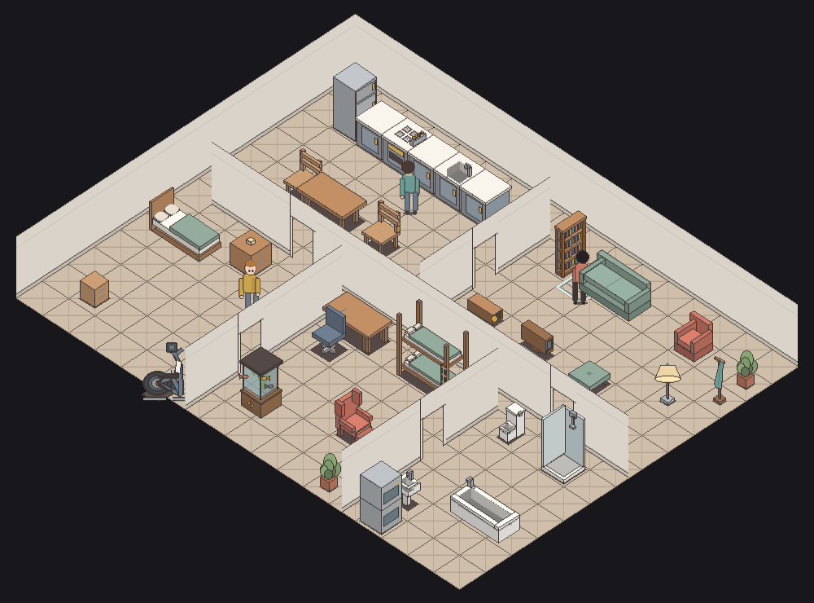

## Interior wall follow-up

The atlas generator reports `371 sprites, 512x3425` and passes
`python -B assets/sprites/gen/build.py --check` with exit 0. Its preservation
hash covers the complete prior 360-sprite prefix, including decoded pixels.

The joined-wall and texture-sampling tests were verified by removing the
mechanisms individually. Both runs produced the named assertion failures,
exited 1, and restored source files byte-for-byte with SHA-256 checks. A worker
startup timeout during the tool outage was discarded and the check rerun.

Four in-memory pixel mutations were also rejected: changing a legacy sprite,
darkening a doorway's shared edge, filling its opening, and removing a visible
junction arm. Restoring those pixels made the generator validator pass again.

At 1.616x zoom, the same 106-pixel strip across two panel seams changed from
four dark pixels to 106 identical wall-face pixels, RGB (218, 211, 201). The
background control differs from that color in both images. The sampled points
are x = 545 through 650, y = round(349 + (695 - x) * 21 / 32 + 45).

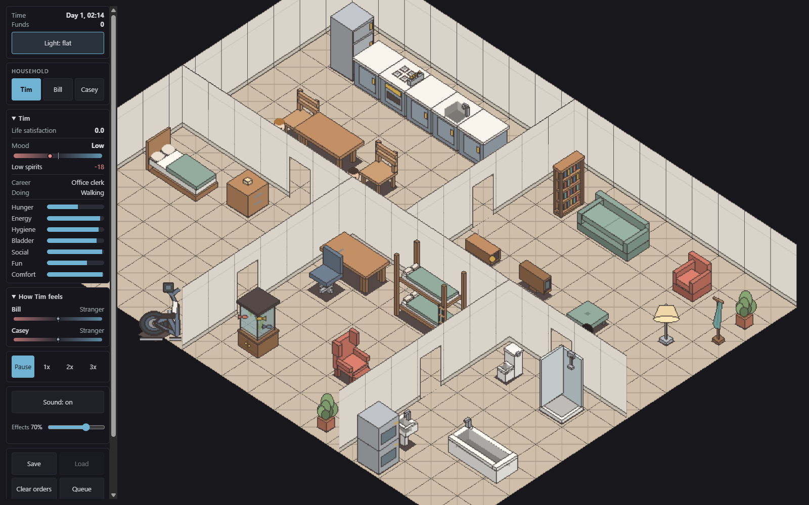

The final release build was inspected again after tool recovery, with the
simulation paused at 04:39. Both flat lighting and automatic night lighting
show continuous junctions and clean doorway edges at enlarged zoom. The
displayed document was visible with WebGPU available; the review page logged
zero console errors and zero warnings.

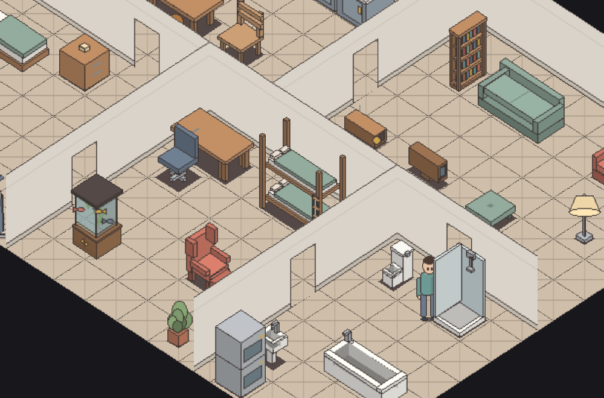

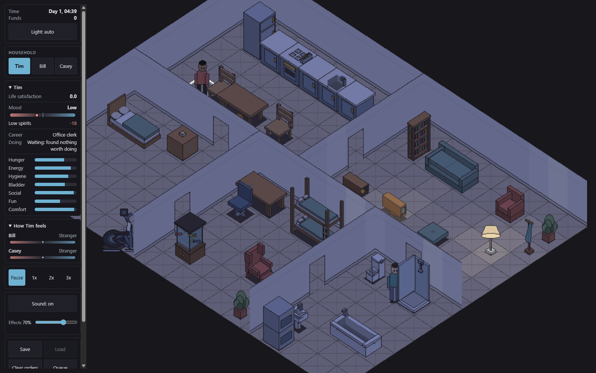

## Origin integration and publication checks

The owner accepted the interior result and authorized publication to remote
`main`. The task branch fast-forwarded from `3cf9941` to `a3559cd`, preserving
the local wall work through a saved stash and a separate file backup.

The animation update had appended its own sprites and changed the exercise
bike. Architecture now appends after all 836 upstream sprites, preserving
their indices and decoded pixels. Its baseline digest was computed directly
from the upstream committed manifest and PNG, then independently matched
against the combined generator output. The resulting atlas has 847 sprites
at 1024 by 4631 pixels. Generated manifests and atlas files were rebuilt from
both sources after resolving the conflicts.

1. `npm --prefix web run typecheck`: PASS, exit 0.
2. `npm --prefix web test -- --maxWorkers=1`: PASS, 538 tests in 37 files, exit 0.
3. `python -B -m unittest discover -s assets/sprites/gen -p 'test_*.py'`:
   PASS, 23 tests, exit 0.
4. `python -B -m unittest discover -s assets/models/sims/sim-01 -p 'test_*.py'`:
   PASS, 21 tests, exit 0.
5. `python -B assets/sprites/gen/build.py --check`: PASS, 847 sprites, exit 0.
6. `cargo test -p terri-data -j 1`: PASS, 182 tests, exit 0.
7. `wasm-pack build crates/terri-wasm --target web --out-dir ../../web/src/wasm`:
   PASS after integration, exit 0.
8. `npm --prefix web run build`: PASS, 45 modules, exit 0.

The animation anchor, clip and shirt-palette tables match the upstream
generated TypeScript exactly. In-memory mutations of an imported body,
doorway edge, doorway opening and junction arm each triggered their named
validator failure. Restoring the pixels restored a passing validator.

The integrated production client was displayed at native and enlarged zoom,
with flat lighting and automatic night lighting at 02:52. WebGPU was available
and the visible page reported zero console errors or warnings. These images
include the upstream characters and the corrected architecture.

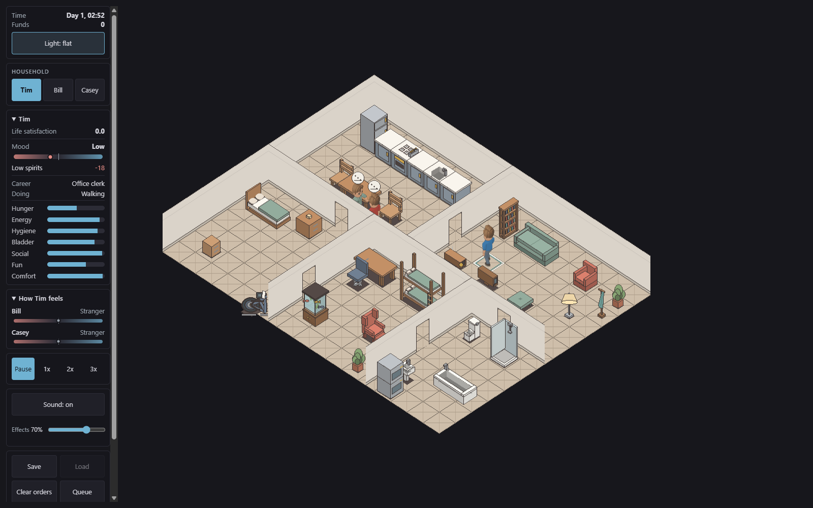

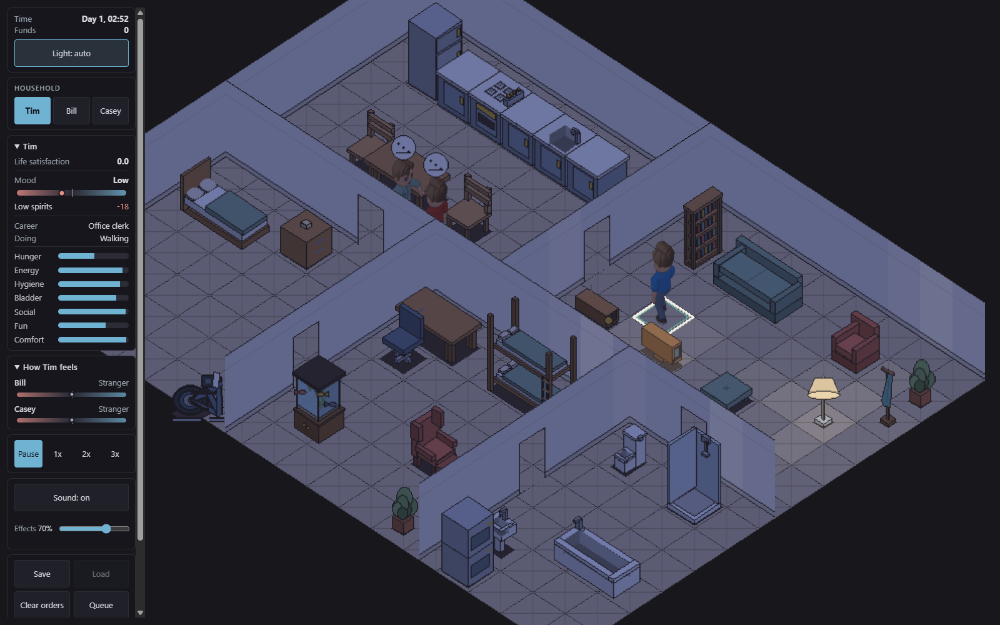

The final rebuilt WASM and client were then reloaded together and inspected
again. The full web suite also passed against that final WASM package.

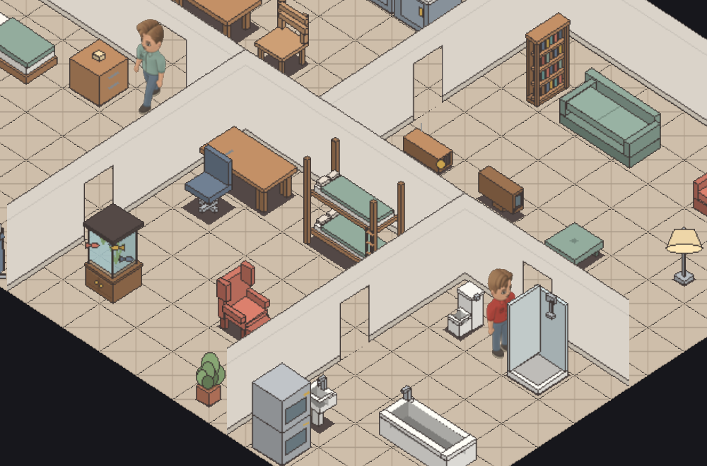

The original `D:/VIBES/terrilives` checkout and its unrelated local edits were
left untouched. Scratch logs and the backup remain outside the commit.

## Corner definition follow-up

The owner requested a visible indication of the corners after accepting the
closed joins. Visible corner junctions now have a muted fold shadow. Two
new end-panel variants mark the back corner and where dividers meet the outer
walls, bringing the atlas to 849 sprites. All 838 existing non-junction
sprites retain their indices, dimensions and decoded pixels.

`npm --prefix web test -- --maxWorkers=1` passes 538 tests. Sprite unittest
discovery passes 26 tests, including three corner tests. Removing the crease
in memory fails the visible-corner and boundary contrast tests. Type checking,
the production client build, atlas `--check`, documentation IDs and patch
whitespace checks pass. Each command exited 0 except the deliberately failing
in-memory mutation.

The displayed WebGPU browser was inspected at enlarged zoom in flat and
automatic night lighting. It reported zero console errors or warnings.
The new shadow preserves each wall's alpha mask, stays within three pixel
columns and ends at the skirting. The following images are local previews
of this follow-up, separate from the previously published wall correction.

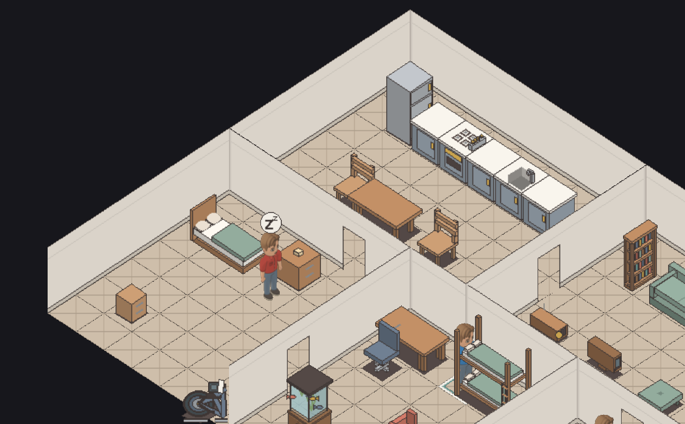

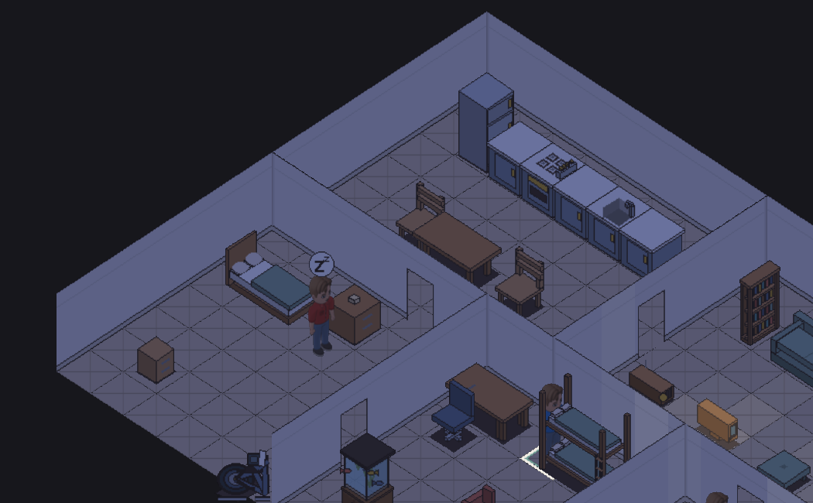

### Visible corners only

The owner approved the crease strength and identified a false crease where
a divider joins the back of a continuous wall. The generator now suppresses
the crease for rear branches behind either wall axis (junction masks 11 and
13). Visible corners retain the approved shadow.

The new regression failed for both rear-junction orientations before the fix
and passed afterward. All 538 web tests and 26 sprite tests pass, as do the
production client build and atlas check. The displayed browser shows the
smooth through-wall and adjacent shaded corner together in flat and night
lighting, with no console errors or warnings.

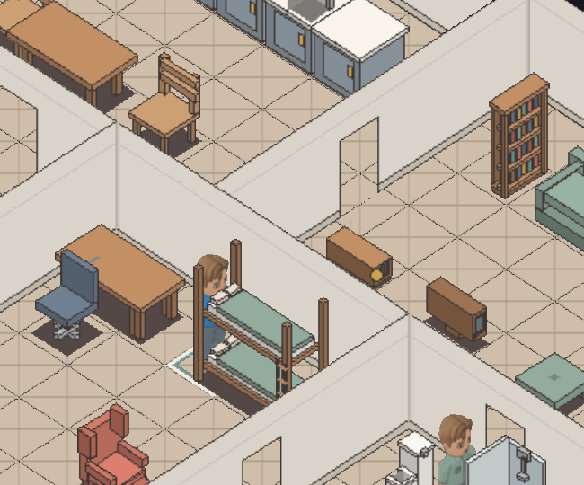

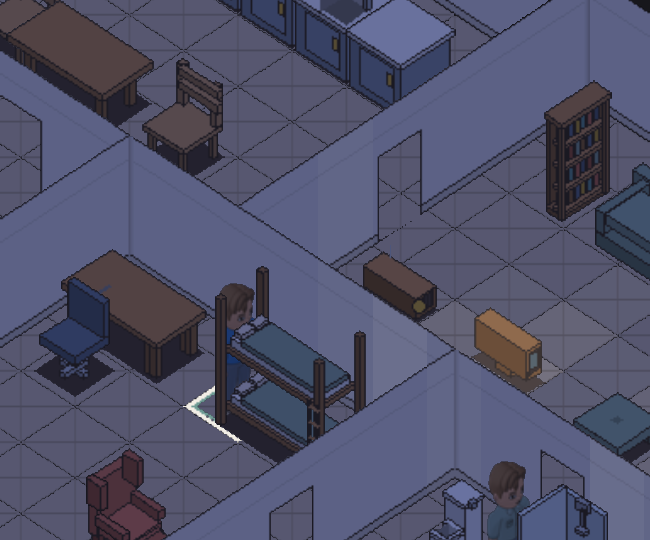
